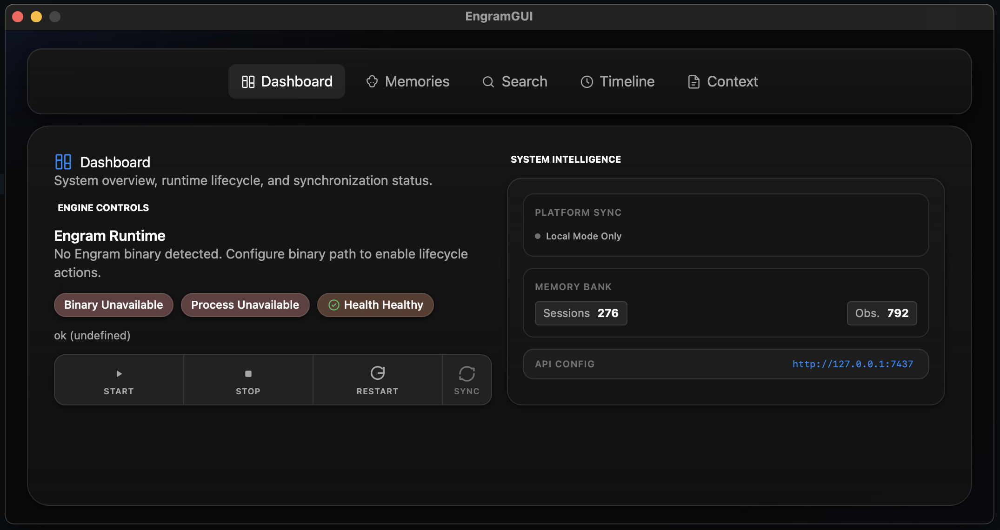
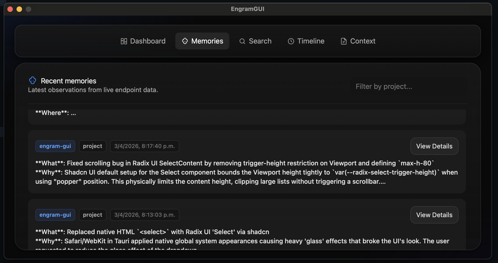
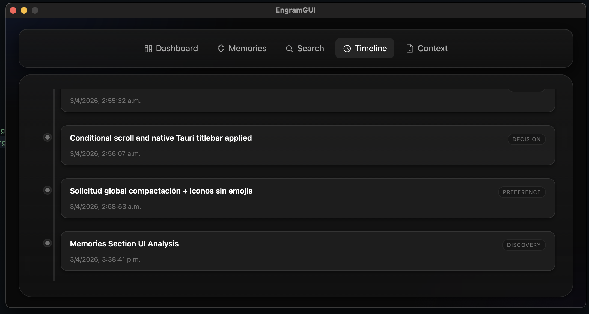

# Engram GUI

Cliente de escritorio open source para Engram.

Engram GUI es un shell local-first construido con React + TypeScript + Vite sobre Tauri 2.
Este repositorio es solo un cliente GUI. El motor de memoria y el servidor API vienen del proyecto principal de Engram:
https://github.com/Gentleman-Programming/engram

Este proyecto sigue en etapa inicial y toda colaboracion es bienvenida.

Idioma:
- Espanol (este archivo)
- English (principal): [README.md](./README.md)

## Capturas

### Dashboard



### Memories



### Timeline



## Que Es Este Proyecto

- GUI de escritorio para operar y visualizar flujos de Engram.
- Se conecta al runtime y a los endpoints HTTP/API expuestos por el servidor CLI de Engram.
- Incluye controles de ciclo de vida y vistas de memories, search, timeline, context y metricas de sync/stats.
- Enfocado en ergonomia para developers y uso local-first.

## Estado Actual

- Health/status del runtime y acciones de lifecycle estan conectadas.
- La semantica del adapter esta normalizada a `success | empty | retryable_failure`.
- Las rutas non-health graduadas y permitidas son: `search`, `timeline`, `context`, `observations`, `sync`, `stats`.
- Los tests de guardrails validan orden de graduacion y precondiciones (contract + adapter + guardrail).
- `get_engram_logs` sigue diferido de forma intencional.

## Stack Tecnico

- Frontend: React 19, TypeScript, Vite, TailwindCSS, shadcn/ui.
- Runtime desktop: Tauri 2 (backend Rust + shell nativo).
- Estado y datos: Zustand + TanStack Query.
- Testing: Vitest + React Testing Library.

## Requisitos

1. Node.js 18+ (o Bun).
2. Toolchain de Rust (stable) para el backend Tauri.
3. Dependencias de Tauri para tu sistema operativo.
4. Engram instalado y disponible localmente (CLI/API server):
   https://github.com/Gentleman-Programming/engram

## Inicio Rapido

```bash
# 1) Instalar dependencias
npm install

# 2) (Opcional pero recomendado) levantar el servidor API de Engram
engram serve 7437

# 3) Ejecutar la GUI en modo desktop dev
npm run tauri dev
```

## Desarrollo Local

### Comandos Principales

```bash
# Frontend dev server
npm run dev

# Type checking
npm run typecheck

# Tests
npm run test
npm run test:watch

# Build de frontend
npm run build

# Passthrough comando Tauri
npm run tauri
```

```bash
# Tests de Rust (dentro de src-tauri)
cd src-tauri
cargo test
```

## Arquitectura Rapida

```text
src/
  app/         shell, routing, providers
  features/    domain features (api/model/ui/stub)
  pages/       route-level screens
  shared/      adapters, contracts, shared types
  components/  reusable UI primitives
src-tauri/
  src/commands runtime, config, and proxy command handlers
```

## Relacion con el Servidor Engram

Este repositorio no reemplaza el core de Engram.
Es un cliente GUI que se integra con el ecosistema CLI/servidor de Engram.

Si necesitas instalacion, setup de agentes, arquitectura o documentacion CLI del motor de memoria, anda a:
https://github.com/Gentleman-Programming/engram

## Como Colaborar

Aceptamos contribuciones y feedback, especialmente en esta etapa inicial.

- Empeza por [CONTRIBUTING.md](./CONTRIBUTING.md).
- Abri issues para bugs, mejoras de UX o nuevas ideas.
- Mantene los PRs enfocados, testeados y simples de revisar.

## Limitaciones Conocidas

- `get_engram_logs` esta fuera de alcance de forma intencional.
- E2E testing todavia no esta habilitado.
- Algunas areas siguen evolucionando como parte del trabajo de graduacion.

## Hoja de Ruta (Etapa Inicial)

- Mejorar completitud de settings y flujos operativos profundos.
- Endurecer workflows de contribucion y templates de comunidad.
- Continuar validando estabilidad y paridad contra endpoints de Engram.

## Seguridad

Si encontras una vulnerabilidad, evita disclosure publico inicial y contacta a maintainers por un canal privado cuando sea posible.

## Licencia

MIT. Ver [LICENSE](./LICENSE).
